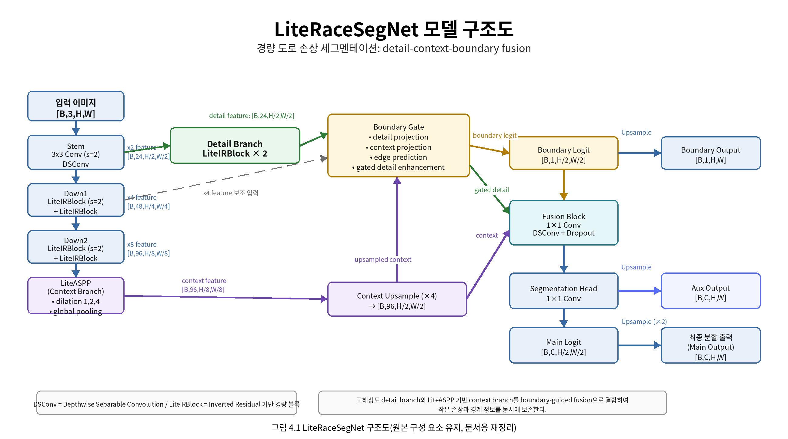
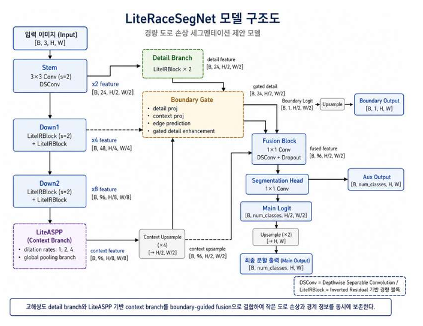
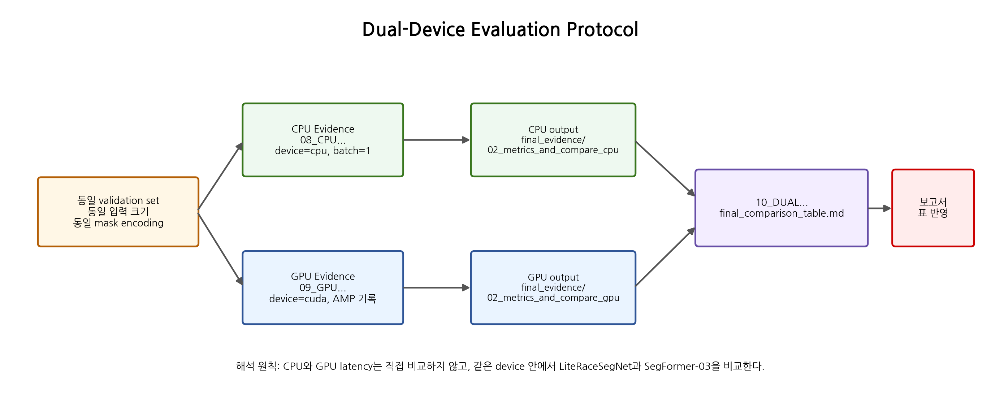

# 아카이브 안내

이 저장소는 LiteRaceSegNet의 초기 포트폴리오/프로토타입 버전입니다.

최신 LiteRaceSegNet-v7 coverage package는 아래 저장소에서 관리합니다.

[LiteRaceSegNet-v7 coverage package](https://github.com/jcicaaa3-cloud/LiteRaceSegNet-v7-coverage-2026-MAY-12ver.-)

본 저장소는 프로젝트 발전 과정과 이전 구조를 보존하기 위해 유지합니다.

# Archive Notice

This repository is an earlier portfolio/prototype version of LiteRaceSegNet.

The newer LiteRaceSegNet-v7 coverage package is maintained separately here:

[LiteRaceSegNet-v7 coverage package](https://github.com/jcicaaa3-cloud/LiteRaceSegNet-v7-coverage-2026-MAY-12ver.-)

This repository is kept for historical reference and project development history.


# LiteRaceSegNet: Road Damage Segmentation Portfolio

PyTorch 기반 도로 손상 세그멘테이션 프로젝트입니다. 
직접 설계한 경량 CNN 모델 **LiteRaceSegNet**과 Transformer baseline **SegFormer-B3**를 분리해서 학습·추론·비교합니다.

이 저장소의 목적은 단순 데모가 아니라, 아래 질문에 답할 수 있게 만드는 것입니다.

> SegFormer 같은 강한 baseline과 비교했을 때, 직접 설계한 경량 CNN이 모델 크기, CPU latency, GPU throughput, mask 품질 사이에서 어떤 trade-off를 보이는가?

## Project highlights

| Area | What this repo shows |
| --- | --- |
| Custom model | LiteRaceSegNet: detail branch, context branch, LiteASPP, boundary-guided fusion |
| Baseline separation | SegFormer-B3는 제안 모델이 아니라 Transformer 비교 baseline으로 분리 |
| Deployment-aware evaluation | CPU-only field use와 AWS GPU acceleration을 나눠 측정 |
| Evidence outputs | CSV/JSON metric, overlay image, mask, service card, report-ready markdown |
| Portfolio hygiene | dataset, pretrained weights, checkpoint, API key를 저장소에 포함하지 않음 |
| License clarity | 이 저장소의 자체 코드만 MIT. 외부 모델, weight, dataset, API는 각자 조건을 따름 |

## Architecture

LiteRaceSegNet은 작은 도로 손상 영역과 불규칙한 경계가 downsampling 과정에서 약해지는 문제를 줄이기 위해 구성했습니다.



주요 구성은 다음과 같습니다.

- **Detail branch**: H/2 해상도에서 얇은 균열, 포트홀 경계, 작은 파손부의 위치 정보를 보존합니다.
- **Context branch + LiteASPP**: 낮은 비용으로 주변 도로 표면, 차선, 그림자 같은 문맥 정보를 반영합니다.
- **Boundary auxiliary head**: ground-truth mask에서 만든 boundary target을 보조 학습 신호로 사용합니다.
- **Boundary gate**: fusion 전에 detail feature를 경계 중심으로 조절합니다.
- **Segmentation head**: binary 또는 multi-class road-damage mask를 생성합니다.

원본 구조도도 보존해 두었습니다.



## Research claim

이 프로젝트는 “LiteRaceSegNet이 모든 조건에서 무조건 이긴다”라고 주장하지 않습니다. 
주장은 실험표가 나온 뒤 아래처럼 제한해서 말하는 게 안전합니다.

> LiteRaceSegNet이 SegFormer-B3 대비 더 작은 parameter count와 FP32 model size, 낮은 latency 또는 낮은 GPU memory 사용량을 보이면서 Damage IoU와 Boundary IoU를 실사용 가능한 수준으로 유지한다면, 도로 손상 세그멘테이션 서비스에서 더 나은 lightweight deployment trade-off를 제공한다고 해석할 수 있다.

## Dual-device evaluation

CPU와 GPU는 목적이 다릅니다. 절대값을 서로 직접 비교하지 않고, 같은 device 안에서 LiteRaceSegNet과 SegFormer-B3를 비교합니다.



| Condition | Purpose | Main metrics | Interpretation |
| --- | --- | --- | --- |
| CPU / no-GPU | GPU 없는 현장형 추론 가능성 확인 | CPU latency, FPS, params, FP32 size | Field deployment evidence |
| AWS GPU / CUDA | 가속 추론, 대량 처리, memory 사용량 확인 | GPU latency, throughput, CUDA memory, AMP | Cloud acceleration evidence |
| Dual summary | 정확도·경계·비용을 함께 판단 | mIoU, Damage IoU, Boundary IoU, latency, memory | Service trade-off |

## Repository layout

| Path | Purpose |
| --- | --- |
| `seg/core/` | dataset pairing, LiteRaceSegNet blocks, model selection, training utilities |
| `seg/train_literace.py` | LiteRaceSegNet training entry point |
| `seg/transformer_b3/` | SegFormer-B3 adapter, setup, and training path |
| `seg/compare/compare_models.py` | CPU/GPU latency, parameter count, size, metric export |
| `seg/tools/build_final_evidence_package.py` | report-ready evidence folder builder |
| `seg/config/` | YAML configs for LiteRaceSegNet and SegFormer-B3 |
| `datasets/pothole_binary/processed/` | expected dataset layout only, no data included |
| `assets/service_demo/input_batch/` | demo input folder, no sample road images included |
| `final_evidence/` | generated evidence output folder, mostly ignored by Git |
| `llm_service/` | optional explanation layer for generated segmentation summaries |
| `scripts/` | Linux/AWS shell scripts matching the Windows batch files |
| `docs/` | portfolio notes, AWS runbook, license/data policy, result templates |

## What is included and not included

Included:

- LiteRaceSegNet source code
- SegFormer-B3 wrapper/training/comparison code
- dataset folder layout notes
- Windows `.bat` scripts
- Linux/AWS `.sh` scripts
- documentation and result templates

Not included:

- raw dataset images or masks
- private road images
- pretrained SegFormer weights
- fine-tuned checkpoints
- generated overlays, CSV, JSON, logs
- API keys or `.env` files
- thesis DOCX/PDF drafts

## Quick start: local or Windows

Install base dependencies:

```bat
00_INSTALL_REQUIREMENTS.bat
```

Optional Transformer dependency and SegFormer local cache:

```bat
01_INSTALL_TRANSFORMER_OPTIONAL.bat
02_SETUP_SEGFORMER_B3_HF.bat
```

Train the two paths separately:

```bat
03A_TRAIN_LITERACESEGNET_ONLY.bat
03B_TRAIN_SEGFORMER_B3_ONLY.bat
```

Build CPU/GPU evidence after checkpoints exist:

```bat
08_CPU_LIGHTWEIGHT_EVIDENCE.bat
09_GPU_ACCELERATION_EVIDENCE.bat
10_DUAL_DEVICE_RESEARCH_EVIDENCE.bat
```

## Quick start: Linux / AWS GPU

```bash
python -m venv .venv
source .venv/bin/activate
pip install --upgrade pip
pip install -r requirements.txt
pip install -r requirements_transformer_optional.txt
```

CPU evidence:

```bash
bash scripts/run_cpu_evidence.sh
```

GPU evidence on a CUDA-enabled AWS instance:

```bash
bash scripts/run_gpu_evidence.sh
```

CPU + GPU report-ready evidence:

```bash
bash scripts/run_dual_device_evidence.sh
```

See `docs/AWS_GPU_RUNBOOK_KO.md` for the full AWS flow.

## Dataset format

Expected layout:

```text
datasets/pothole_binary/processed/
 train/
  images/
  masks/
 val/
  images/
  masks/
```

Mask rule:

- background: `0`
- damage region: any value greater than `0`

Image and mask files should share the same base name. The pairing checker accepts common variants such as `mask`, `gt`, and `label` suffixes.

```bash
python seg/tools/check_dataset_pairs.py --root datasets/pothole_binary/processed
```

## Evaluation outputs

The comparison script exports both CSV and JSON.

| Field | Meaning |
| --- | --- |
| `params`, `param_million` | trainable parameter count |
| `param_size_mb_fp32` | estimated FP32 parameter size |
| `device`, `device_name` | profiling device and hardware name |
| `cpu_threads` | PyTorch CPU thread count when CPU is used |
| `latency_ms`, `latency_std_ms` | repeated forward-pass latency |
| `throughput_fps` | approximate images per second |
| `cuda_peak_memory_mb` | CUDA peak memory during GPU profiling |
| `pixel_acc`, `miou_binary`, `iou_damage`, `boundary_iou` | segmentation metrics when masks/checkpoints exist |
| `eval_images` | number of evaluated validation images |

Report-ready files are written under:

```text
final_evidence/06_report_ready/
 final_comparison_table.md
 capstone_result_summary.md
```

## Portfolio talking points

Use these points in GitHub README, resume, or interview.

- Implemented a custom lightweight semantic segmentation model for road-damage masks.
- Separated the proposed CNN model from the Transformer baseline to keep evaluation clean.
- Added CPU and CUDA profiling to avoid reporting accuracy alone.
- Exported reproducible evidence tables instead of relying on screenshots.
- Kept datasets, weights, and generated files outside the public repository for license and privacy safety.

## License and asset policy

This repository uses the MIT License for source code written specifically for this project. See `LICENSE`.

The MIT License **does not** apply to external datasets, pretrained model weights, Hugging Face model files, third-party libraries, APIs, or any asset not authored for this repository. Those items remain under their own licenses and terms.

Read these before publishing the GitHub repo:

- `THIRD_PARTY_NOTICES.md`
- `ASSET_AND_LICENSE_POLICY.md`
- `docs/GITHUB_RELEASE_CHECKLIST_KO.md`

## Limitations

- Final metric values depend on the dataset and checkpoints you provide locally.
- SegFormer-B3 comparison requires optional Transformer dependencies and a fine-tuned checkpoint.
- CPU/GPU latency depends on hardware, driver state, image size, batch size, thread count, and background processes.
- Demo overlays are useful for review, but final claims should come from the exported comparison table.
- Dataset license and model weight license must be checked before redistribution.
